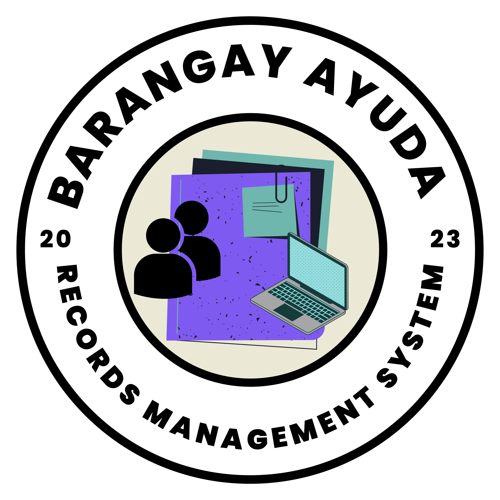

# Barangay Ayuda and Records Management System

The Barangay Ayuda and Records Management System is a web application designed to assist barangays (small administrative divisions in the Philippines) in managing their aid programs and records effectively. The system provides features for managing aid requests, processing aid applications, tracking aid distributions, and maintaining records of beneficiaries and aid programs.

## Features

- Aid Request Management: Allows residents to submit aid requests online, and barangay officials to review and process aid applications.
- Aid Distribution Tracking: Enables barangay officials to track aid distributions, including the type of aid, quantity, and recipient information.
- Beneficiary Management: Provides a centralized database for managing beneficiary information, including personal details, aid history, and eligibility status.
- User Authentication and Authorization: Integrates NextAuth.js for secure user authentication and authorization, allowing only authorized users to access the system.
- Data Management: Utilizes MongoDB as the database for storing aid requests, aid distributions, beneficiary information, and other relevant data.
- Responsive UI: Built with Next.js and Tailwind CSS, the system provides a responsive user interface that works seamlessly on different devices and screen sizes.

## Technologies Used

The Barangay Ayuda and Records Management System is built using the following technologies:

- Frontend: Next.js, React, Tailwind CSS
- Backend: Next.js API Routes, NextAuth.js for authentication
- Database: MongoDB, Mongoose for communication
- Deployment: Vercel for both frontend and backend
- Version Control: Git

## Installation and Usage

To install and use the Barangay Ayuda and Records Management System, follow these steps:

1. Clone the repository from GitHub: `git clone https://github.com/yourusername/barangay-ayuda.git`
2. Install the dependencies: `npm install`
3. Configure the environment variables: Create a `.env` file in the root directory of the project and set the necessary environment variables, such as database connection details, NextAuth.js configuration, etc.
4. Start the development server: `npm run dev`
5. Access the application in your web browser at `http://localhost:3000`

## Contributing

Contributions to the Barangay Ayuda and Records Management System are welcome! If you want to contribute to the project, please follow these steps:

1. Fork the repository
2. Create a new branch for your feature or bugfix: `git checkout -b feature/your-feature-name`
3. Make your changes and commit them: `git commit -m "Description of your changes"`
4. Push your changes to your forked repository: `git push origin feature/your-feature-name`
5. Create a pull request to the main repository for review.

## License

The Barangay Ayuda and Records Management System is open-source software released under the [MIT License](LICENSE). Feel free to use, modify, and distribute the system as per the terms of the license.
